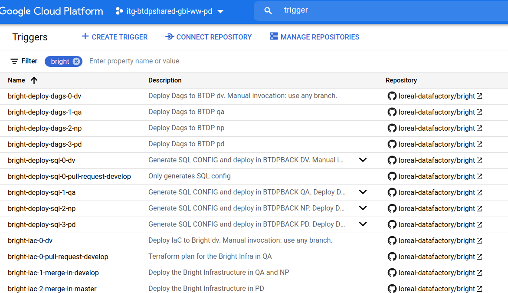

# README - Project template

## Purpose

This README aims to describe how to use the project-template repository
to setup a new use case project.

PLEASE KEEP IN MIND THAT THIS A TEMPLATE. IT IS NOT SUPPOSED TO BE USED AS IS.
NECESSARY ADAPTATION TO YOUR NEEDS IS MANDATORY.

## Table of content

  * [Content](#content)
  * [`setup` directory](#-setup--directory)
    + [0. content](#0-content)
    + [1. `init` directory](#1--init--directory)
      - [Description](#description)
      - [Conventions](#conventions)
    + [2. `cicd` directory](#2--cicd--directory)
      - [Description](#description-1)
  * [Environments](#environments)
  * [Workflows](#workflows)
  * [`iac` directory](#-iac--directory)
  * [`modules` directory](#-modules--directory)
  * [Prerequisites](#prerequisites)
  * [Get Started](#get-started)
    + [1. initialize the project](#1-initialize-the-project)
    + [2. activate the cicd](#2-activate-the-cicd)
    + [3. implement the features](#3-implement-the-features)
  * [Development](#development)

<small><i><a href='http://ecotrust-canada.github.io/markdown-toc/'>Table of contents generated with markdown-toc</a></i></small>

## Content

The repository contains the following components:

```
├── environments
├── Makefile
├── README.make.md
├── README.md
├── iac
├── modules
├── workflows
└── setup
```


## `setup` directory

This directory aims to set up a project, _i.e_ make it ready to be used and functional.
The setup is divided into 2 elements, the `init` and the `cicd`. The directory tree is
presented below.

### 0. content

```
 .
├── cicd
│   ├── Makefile
│   ├── README.md
│   ├── locals.tf
│   ├── md5.tf
│   ├── projects.tf
│   ├── provider.tf
│   ├── roles.tf
│   ├── triggers.tf
│   └── variables.tf
└── init
    ├── Makefile
    ├── README.md
    ├── api.tf
    ├── apis.txt
    ├── cloudbuild.yaml
    ├── gae.tf
    ├── locals.tf
    ├── provider.tf
    ├── roles.tf
    ├── storage.tf
    └── variables.tf
```

### 1. `init` directory

#### Description

The goal of this directory is to provide the keys elements necessary to run the
project, _i.e._, the:

* activation of the required Google APIs
* the mandatory infrastructure elements for the project to be operational:
  - GCS Bucket: stores the terraform states and the CloudRun Url suffix


#### Conventions

 item  | Comment
-------|--------------------
`api.tf` | will contain the list of APIs to be activated
`gae.tf` | will contain the code that create and manage the App Engine application


### 2. `cicd` directory

#### Description

All the CICD configuration is contained in the setup/cicd directory.
This CICD configuration is a Terraform module.

The CICD Terraform module contains configuration for:
* Cloud Run modules under the `/modules` directory;
* Infra as code (IaC) under the `/iac` directory
* IAM rules for CloudBuild Service Account (SA).
  Indeed, the Cloudbuild SA needs permissions to performs tasks on the GCP resources.
  Adapt the `roles` local var in `setup/cicd/locals.tf` file according to the project needs.

Of course, other configuration can (must) be added according to the use case needs.

See the detailed [README](setup/cicd/README.md) to know how to setup the CICD.

## `environments` directory

This directory contains configurations files for the cicd and environment configuration files for sandbox and normalized environments.

You must create a configuration file for your sandbox environment.

See the detailed [README](environments/README.md) to know more about the content of environments files.

## `iac` directory

This directory contains the global infrastructure "as code" of the project.

One must add terraform files according to their needs.

See the detailed [README](iac/README.md) to know more about the `iac` directory content.

## `modules` directory

This directory contains examples of Cloud Run modules to be used by the project.


## Prerequisites

1. create an empty repository with an initial empty commit
2. copy the content of the project template repository into the newly created repo
3. adapt the template content to your needs


## Get Started

1. initialize the project
2. activate the cicd
3. implement the features

### 1. initialize the project

> warning: ensure that the content of the setup/init directory matches your
> needs before executing the command. Adapt to your needs.

```shell
cd setup/init
gcloud config set project USE_CASE_PROJECT_ID
make all
```

Or more direct:
```shell
make init
```

Replace USE_CASE_PROJECT_ID with the project Id of the use case project

> nota: this should be executed on every use case projects (dv, qa, np, pd)

**Expected results:**

A GCS Bucket <:NAME:>-gcs-deploy-eu-<:PROJECT_ENV:> is created for every project

Each GCS Bucket contains the Terraform state of the init configuration, for example:

* `Buckets > projecttemplate-gcs-deploy-eu-dv > terraform-state > init`

* `Buckets > projecttemplate-gcs-deploy-eu-qa > terraform-state > init`

* `Buckets > projecttemplate-gcs-deploy-eu-np > terraform-state > init`

* `Buckets > projecttemplate-gcs-deploy-eu-pd > terraform-state > init`

Each gCS Bucket contains the Cloud Run URL suffix, for example:

* `Buckets > projecttemplate-gcs-deploy-eu-dv > cloudrun-url-suffix`

* `Buckets > projecttemplate-gcs-deploy-eu-qa > cloudrun-url-suffix`

* `Buckets > projecttemplate-gcs-deploy-eu-np > cloudrun-url-suffix`

* `Buckets > projecttemplate-gcs-deploy-eu-pd > cloudrun-url-suffix`

```
$ gsutil ls gs://<bucket_name>
gs://<bucket_name>/cloudrun-url-suffix/
gs://<bucket_name>/terraform-state/
```

The url suffix is stored in a file named after the deployment region, and located in the folder cloudrun-url-suffix
```
$ gsutil ls gs://<bucket_name>/cloudrun-url-suffix/
gs://<bucket_name>/cloudrun-url-suffix/<deployment-region>

```
here the file is ```<deployment-region>```, for instance ```europe-west1```

### 2. activate the cicd

> warning: ensure that the content of the setup/cicd directory matches your
> needs before executing the command. Adapt to your needs if necessary.
> Do read the [dedicated README](setup/cicd/README.md) for more information.

```shell
cd setup/cicd
gcloud config set project CICD_PROJECT_ID
make all
```

or more direct:
```shell
make cicd
```

It can also be triggered using Cloud Build:
```shell
make gcb-cicd
```

**Expected results:**

Your Cloud Build Triggers are up and running on https://console.cloud.google.com/storage/browser?project=<use_case_project_id>

Example for the use case `bright`



### 3. implement the features

`modules`: see the README in the examples modules provided in `/modules` directory


## Development

This repository provides tools for developers.

Those tools allows them to test, build, plan and/or deploy resources
on their environments (such as GCP sandbox).

See the detailed [README.make.md](README.make.md).
